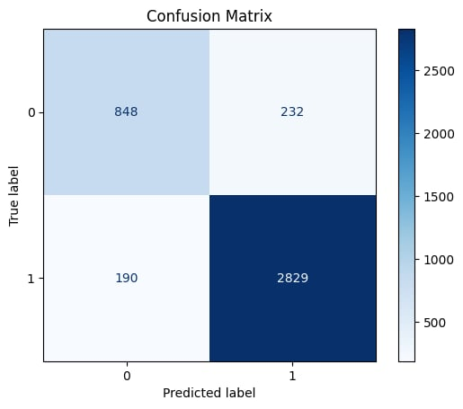

# Sentiment-Aware Hotel Recommendation System
This project enhances traditional location-based search results by applying Sentiment Analysis to hotel reviews. Instead of returning location links blindly, the system analyzes user feedback and prioritizes places with high positive sentiment. Built with machine learning models (SVC, Logistic Regression, Random Forest, XGBoost), this system ensures better quality-driven recommendations.

## Use Case 

Imagine you ask a chatbot:  
**"Where should I stay in Tokyo?"**  
Instead of returning generic links, this system scans hotel reviews, performs sentiment analysis, and ranks hotels by the Bayesian Average of positive feedback— giving you smart, data-driven suggestions.

### Installation & Run

- Requirements:

+ Python ≥ 3.8
+ pip
+ Docker 

---
- Setup Environment

git clone https://github.com/Vinh-Sta/sentiment_aware_location_recommendation_ml_dl.git 

cd sentiment_aware_location_recommendation_ml_dl.git

# (Recommended) Create virtual environment
python -m venv venv
source venv/bin/activate  # On Windows: venv\Scripts\activate

# Install dependencies
pip install -r requirements.txt

# Run FastAPI
python server.py (window)
python3 sever.py
# Model Deployment
docker build -t sentiment-app .
docker run -p 8888:8888 sentiment-app

Then Cick on: http://0.0.0.0.8888, then write 127.0.0.1:8888/docs run

REST API deployed at 127.0.0.1:8888
Accepts POST request with text review input

Returns: {"sentiment": "positive"} or {"sentiment": "negative"}

## Dataset

- Source: [TripAdvisor Hotel Reviews on Kaggle](https://www.kaggle.com/datasets/andrewmvd/trip-advisor-hotel-reviews)
- Size: 20,491 user reviews  
- Classes: `positive` and `negative` (binary sentiment)

> **Final Model Used for Deployment:** `SVC(class_weight='balanced')`

###  Confusion Matrix

## Key Metrics
+Precision-focused to avoid recommending poor hotels

+ Bayesian Average Rating applied to discount low-review-count hotels
For example:
Hotel A: 2 reviews, 100% positive →  Not trustworthy

Hotel B: 500 reviews, 85% positive →  More reliable

-Preprocessing Pipeline
+ Remove punctuation, digits, stopwords
+ Lemmatization (NLTK)
+ TF-IDF vectorization (min_df=0.01, max_df=0.9)
+ Train-test split with stratify=y

Example Inference (via Python) : Machine_Learning_training.ipynb 

Save model: support_vector.pkl

# Possible Improvements
+ Multi-class classification: negative, neutral, positive

+ Deep learning (LSTM, BERT) for better context

+ Explainability with SHAP or LIME

+ Domain-specific embeddings

+ Data augmentation for minority class

## Fine-tuning BERT
Besides traditional models like SVC, Logistic Regression, etc., I experimented with fine-tuning the BERT model to improve sentiment classification accuracy.

Model used: bert-base-uncased (via the Transformers library)

Code: NLP_DEEP_Learning.ipynb 

Fine-tuning techniques:

+ Tokenization using BertTokenizer
+ Training for up to 10 epochs with early stopping based on validation accuracy
+ Optimizer: AdamW with a fixed learning rate (no scheduler)
+ Output classification layer included in BertForSequenceClassification
+ The CLS token embedding is implicitly used by the classification layer

# Training results:
+ Confusion Matrix:
  

+ Loss/ Train were recorded and visualized after each epoch: 
  

+ Validation Accuracy: 
  

